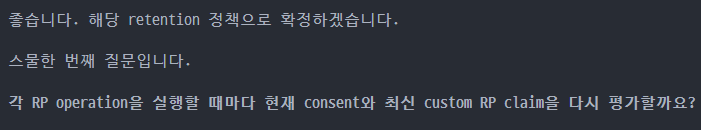
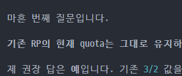
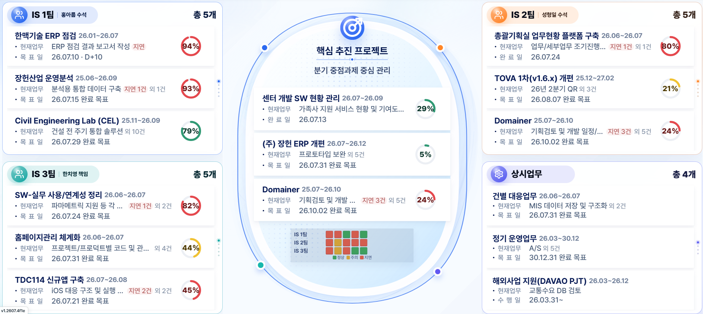
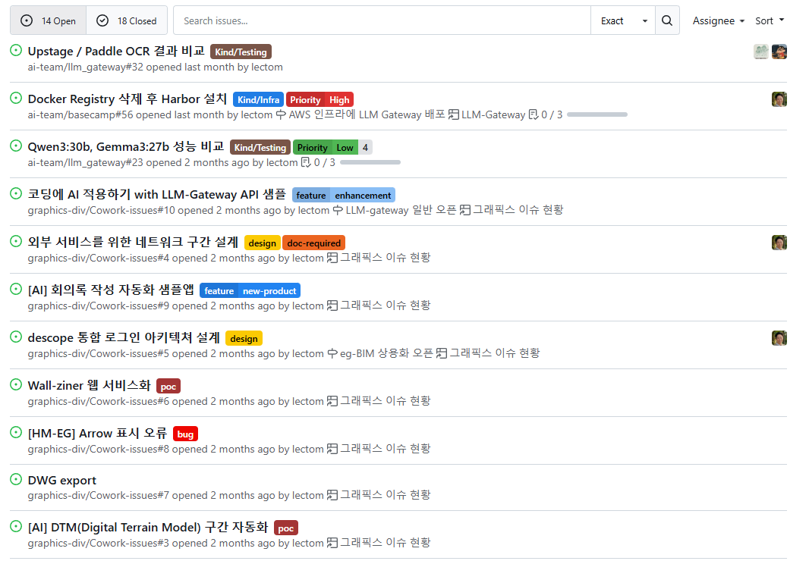
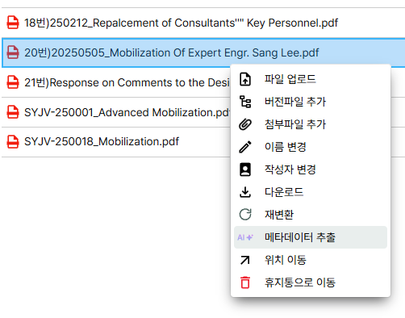
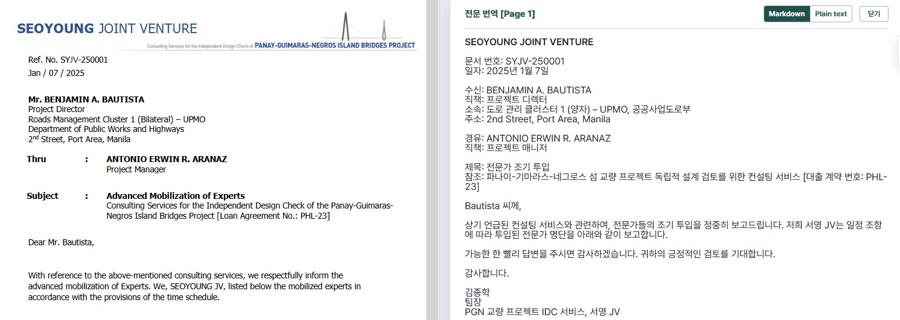

# AI의 기본 이해

## 도메인 지식 살려 AI로 가속화하기

통합 시스템 한치영 책임

---
layout: default
class: two-column-page
---

# 인공지능이란 무엇인가?

  <section>
    <h2>자동지능이 아니고 인공지능</h2>
    <ul>
      <li>NLP(자연어 처리)</li>
      <li>트랜스포머와 어텐션
        <ul>
          <li>"Attention is All You Need" - Google (2017)</li>
        </ul>
      </li>
      <li>GPT 2 창발성의 탄생
        <ul>
          <li>"Language Models are Unsupervised Multitask Learners" - OpenAI (2019)</li>
          <li>https://huggingface.co/openai-community/gpt2</li>
        </ul>
      </li>
    </ul>
  </section>
  <section>
    <h2>장미빛? 혹은 잿빛 미래?</h2>
    <ul>
      <li>일자리가 줄어든다
        <ul>
          <li>AI는 당신의 일자리를 빼앗지 않는다. 당신의 경쟁자가 당신의 일까지 해 버릴 수 있게 해줄 뿐</li>
          <li>수천페이지 문서를 한시간 안에 분석해 구조화 하기</li>
          <li>양은 문제가 안된다. 능력만 있다면 밤새 일 시킬 수 있다</li>
        </ul>
      </li>
      <li>사무직의 일 하는 방법이 바뀔 수 밖에 없다
        <ul>
          <li>소수민족 언어까지 마스터한 언어 천재</li>
          <li>단순 생상량으로 따지면 포크레인과 삽의 차이보다 크다</li>
        </ul>
      </li>
    </ul>
  </section>

---
layout: default
class: two-column-page
---

# AI라는 도구

  <section>
    <h2>기술(Technology)은 기본적으로 도구</h2>
    <ul>
      <li>AI라는 단어를 컴퓨터/스마트폰으로 바꿔 읽어보자
        <ul>
          <li>더 많은 생산을 할 수 있게 되었고, 못 했지만 할 수 있게 된 일도 생겼다</li>
          <li>산업이 탄생하고 생활 양식이 바뀌기도 했지만 잘 사용하는 사람들의 특징은 변하지 않았다.</li>
        </ul>
      </li>
    </ul>
    <h2>지금까지 혁명과 차이점</h2>
    <ul>
      <li>엄청나게 빠르다. 현재 못 한다고 앞으로 못 할거라 단정할 수 없음 </li>
      <li>생태계가 만들어지면서 전파되는 중 </li>
    </ul>
  </section>
  <section>
    <h2>기능으로 경쟁하지 않기</h2>
    <ul>
      <li>자동차와 달리기 시합</li>
      <li>인류 최강 바둑기사가 흑2점 깔고 두기</li>
      <li>수능 만점 / 국제 수학올림피아드 금매달</li>
    </ul>
  </section>

---
layout: default
class: two-column-page
---

# 책임은 지지 않는 천제가 내 부하직원이 된다면?

  <section>
    <h2>어떤 부하직원?</h2>
    <ul>
      <li>절대 스스로 먼저 움직이지 않고</li>
      <li>책임을 지지 않기 때문에 맹목적으로 믿을 수도 없고</li>
      <li>어느날 갑자기 성향, 성능, 말투, 일을 처리하는 방식이 변해있고</li>
      <li>기능을 따져보면 저렴해 보이는데 그 만큼 성과를 증명하기 쉽지 않다</li>
    </ul>
  </section>
  <section>
    <h2>누구에게나 주어진 부하</h2>
    <ul>  
      <li>개인이 조직을 상대하면 장기적으로는 무조건 진다
        <ul>
            <li>누구나 사용할 수 있으니, 누구나 조직적 힘을 낼 수 있게 되었다</li>
            <li>즉, 사용하지 않으면 도태될 수 밖에 없다</li>
        </ul>
      </li>
      <li>도메인지식은 없으나 능력치는 인류 최강</li>
    </ul>
  </section>

---
layout: default
class: two-column-page
---

# 나는 어떤 팀장이 되어야 할까?

  <section>
    <h2>실무능력과 큰그림을 동시에 갖춰야 한다</h2>
    <ul>
      <li>디테일한 지시를 할 수 있고 수정사항을 명확하게 문장화 할 수 있는 능력
        <ul>
          <li>AI는 common sense는 강하고 context는 약하다.</li>
          <li>매번 주입해 줄 수 없으니 공용 지식 저장소 같은 곳을 가리키며 찾아보라고 가이드 하는 것이 바람직</li>
        </ul>
      </li>
      <li>큰 그림을 이해시켜 주자 - 설명하면서 나도 성장한다
        <ul>
          <li>그렇게 해야 하는 이유를 말로 설명하면 더 잘 따른다</li>
        </ul>
      </li>
      <li>일을 끝까지 마무리 짓는 책임은 나에게 있다
        <ul>
          <li>예상외로 엄청나게 쉬운 부분도 있지만 엉덩이 힘으로 일 하는 업태 자체는 바뀌지 않는다</li>
        </ul>
      </li>
    </ul>
  </section>
  <section>
    <h2>모두가 천재 부하직원이 있는 팀들 사이에서 살아남기</h2>
    <ul>
      <li>새로운 환경에 적응하는데 힘든 것은 당연</li>
      <li>전문 용어를 사용하는 것은 좋다. 하지만 이해를 못하는 것 같다면 바로 개입해 조정해 줄 수 있어야 한다</li>
      <li>오늘날 LLM들은 컴퓨터 언어가 모국어이다. 내 생각을 시스템화 하는 것으로 시작하는 것이 좋다</li>
    </ul>
  </section>

---
layout: default
class: two-column-page wide-example-page
---

# [Tip] Grill-me skill

  <section>
    <h2>AI와 이해 일치시키기</h2>
    <ul>
      <li>코드나 문서 베이스가 있는 상태에서 해당 스킬을 이용해 일을 시키면
        <ul>
            <li>코드나 문서를 읽은 후 궁금한 지점은 나에게 질문을 함 </li>
            <li>선택이 필요한 경우는 자신이 권하는 제안을 이유와 함께 알려줌 </li>
            <li>AI가 서로 Gap이 좁혀졌다고 느낄 때까지 질문의 반복</li>
        </ul>
      </li>
    </ul>
  </section>
  <section>
    <h2>실제 예시</h2>
    

      
      
    

  </section>

---
layout: default
class: tips-page center-showcase-page
---

# 센터에서는 어떻게 사용하고 있나요?

  
  

    
    
    
  

